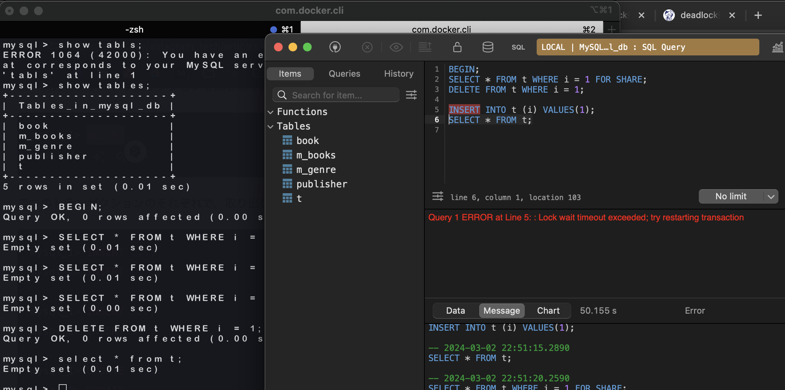

# Beauty Parlor Salon

## Image

## premise

- Mac M1
- AWS IMA Account
- aws configure
- AWS: aws-cli/2.2.36 Python/3.8.8 Darwin/20.6.0 exe/x86_64 prompt/off
- Docker: 20.10.8, build 3967b7d
- Python: 3.9.1
- serverless: Framework Core: 3.2.1, Plugin: 6.1.0, SDK: 4.3.1
- node: v16.8.0

## local Flow

```bash
# 1
add `.env`
# 2. build
docker-compose up -d --build
# 3. exec
docker-compose exec beauty-parlor-salon-dev bash
# 4. Run test
## all
python3 -m pytest -sv
## single
python3 -m pytest -sv tests/test_app.py::test_read_main
```

## ECR Flow

1. Create ECR Repository
2. add `.env`
3. `docker-compose build`
4. `docker push {ECR_IMAGE}:latest`
   - ex: ECR_IMAGE: `123456789123.dkr.ecr.{region}.amazonaws.com/lambda-container`
5. Create Lambda Function
6. `sls deploy`
7. test API endpoint

## .env list

The list of `.env` is raised below

```bash
# aws
ECR_IMAGE=xxx
ECR_DIGEST=sha256:xxx
REGION=ap-northeast-1

# mariadb
TAG=11.3

DB_PORT=3306
DATABASE=beauty_salon
MYSQL_DATABASE=mariadb
TEST_DATABASE=test_beauty_salon

## user
MYSQL_USER=user
MYSQL_PASSWORD=password

MYSQL_ROOT_USER=root
MYSQL_ROOT_PASSWORD=password

# const
SECRET_KEY=xxx
```

## Reproduce deadlock

1. Access Terminal
2. Access MySQL

   ```bash
   docker exec -it mysql_db bash

   # bash-4.4#
   mysql -u root -p
   ```

3. Run the following command

   ```sql
   mysql> show databases;
   +--------------------+
   | Database           |
   +--------------------+
   | information_schema |
   | mysql              |
   | mysql_db           |
   | performance_schema |
   | sys                |
   +--------------------+
   5 rows in set (0.01 sec)

   mysql> use mysql_db
   Reading table information for completion of table and column names
   You can turn off this feature to get a quicker startup with -A

   Database changed
   mysql> show tables;
   +--------------------+
   | Tables_in_mysql_db |
   +--------------------+
   | book               |
   | m_books            |
   | m_genre            |
   | publisher          |
   | t                  |
   +--------------------+
   5 rows in set (0.01 sec)

   mysql> BEGIN;
   Query OK, 0 rows affected (0.00 sec)

   mysql> SELECT * FROM t WHERE i = 1 FOR SHARE;
   Empty set (0.01 sec)

   mysql> DELETE FROM t WHERE i = 1;
   Query OK, 0 rows affected (0.00 sec)

   mysql> select * from t;
   Empty set (0.01 sec)

   ```

4. TablePlus
   ```sql
   BEGIN;
   SELECT * FROM t WHERE i = 1 FOR SHARE;
   DELETE FROM t WHERE i = 1;
   -- here: Query 4 ERROR at Line 4: : Lock wait timeout exceeded; try restarting transaction
   INSERT INTO t (i) VALUES(1);
   SELECT * FROM t;
   ROLLBACK;
   ```
    2 箇所から mysql にアクセスし、トランザクションを開始すると、デッドロックが発生する。
    

## Reference

- Perform a deadlock test.

  Ref: https://propen.dream-target.jp/blog/mysql-deadlock/

  ```bash
  Deadlock found when trying to get lock; try restarting transaction
  ```

  Ref:

  - https://dev.mysql.com/doc/refman/8.0/ja/innodb-deadlock-example.html
  - https://zenn.dev/aldagram_tech/articles/66e85a6d08c047

